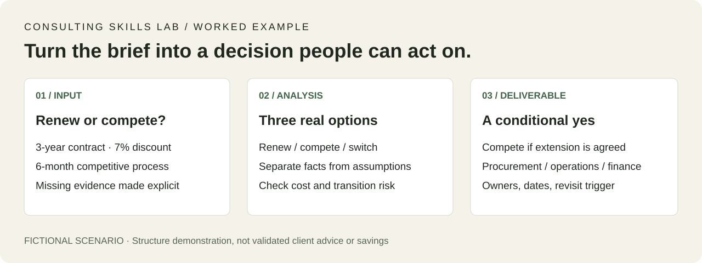

# Consulting Skills Lab

[](https://github.com/Uky0Yang/consulting-skills-lab/actions/workflows/validate.yml)
[](https://github.com/Uky0Yang/consulting-skills-lab/releases/latest)
[](LICENSE)

Eleven reusable Codex-style consulting skills for problem framing, research, pricing, strategy, transformation, diligence, execution, communication and presentation design.

This repository packages practical consulting workflows as portable skill folders. Start with an ambiguous decision, organize interview evidence, or audit pricing economics; then move into market analysis, diligence, a decision memo or an accountable execution plan. Skills also cover scaling agentic AI beyond pilots, case-interview practice and analytical slide formatting.

## Who this is for

[](examples/decision-memo-walkthrough.md)

[30-second walkthrough: input → analysis → decision memo](examples/decision-memo-walkthrough.md). Fictional inputs are clearly labelled; this demonstrates the output structure, not a real client outcome.

- Builders who want consulting-grade structure for ambiguous business problems.
- Strategy, product, operations, and transformation teams using AI assistants.
- Solo operators who need repeatable issue trees, memos, workplans, and risk registers.

## Skills

| Skill | Use it for | Example |
| --- | --- | --- |
| [`business-problem-framing`](skills/business-problem-framing/SKILL.md) | Ambiguous requests, decision boundaries, issue trees, competing hypotheses | [CRM investment request](examples/business-problem-framing.md) |
| [`expert-interview-synthesis`](skills/expert-interview-synthesis/SKILL.md) | Neutral interview guides, evidence provenance, conflicting views, findings | [Ticket-triage pilot](examples/expert-interview-synthesis.md) |
| [`pricing-unit-economics`](skills/pricing-unit-economics/SKILL.md) | Pricing options, contribution, CAC/payback, break-even and validation | [Support-software offer](examples/pricing-unit-economics.md) |
| [`agentic-ai-transformation-office`](skills/agentic-ai-transformation-office/SKILL.md) | AI transformation, pilot-to-value diagnosis, workflow redesign, governance | [90-day pilot reset](examples/agentic-ai-transformation-office.md) |
| [`market-map-signal-scan`](skills/market-map-signal-scan/SKILL.md) | Market analysis, competitive landscape, signal confidence, opportunity gaps | [Contact-center QA market](examples/market-map-signal-scan.md) |
| [`market-sizing-sanity-check`](skills/market-sizing-sanity-check/SKILL.md) | TAM/SAM/SOM, demand sizing, capacity and growth sanity checks | [Compliance software sizing](examples/market-sizing-sanity-check.md) |
| [`commercial-due-diligence-sprint`](skills/commercial-due-diligence-sprint/SKILL.md) | Target assessment, investment memo, growth and customer diligence | [Vertical SaaS diligence](examples/commercial-due-diligence-sprint.md) |
| [`executive-decision-memo`](skills/executive-decision-memo/SKILL.md) | Board memo, steering note, decision recommendation | [Vendor renewal decision](examples/executive-decision-memo.md) |
| [`value-creation-plan`](skills/value-creation-plan/SKILL.md) | 100-day plans, synergies, initiative ownership, benefits tracking | [Distributor value plan](examples/value-creation-plan.md) |
| [`consulting-case-interview-coach`](skills/consulting-case-interview-coach/SKILL.md) | Mock cases, case math, anchored feedback, practice planning | [Profitability case](examples/consulting-case-interview-coach.md) |
| [`consulting-template-style`](skills/consulting-template-style/SKILL.md) | Consulting decks, chart books, slide redesign, formatting QA | [Market-entry deck](examples/consulting-template-style.md) |

## Choose a Starting Point

- **The problem or decision is unclear:** use `business-problem-framing`. Carry the decision brief, metric definitions and priority hypotheses into research.
- **You have interview notes, not trustworthy conclusions:** use `expert-interview-synthesis`. Carry source IDs, contrary evidence, confidence and verification tasks into market analysis or diligence.
- **You need to know whether an offer can make money:** use `pricing-unit-economics`. Carry cost definitions, calculated thresholds and unverified demand assumptions into a decision memo or value plan.
- **The question is already clear:** go directly to the relevant existing skill. The skills are independent; the sequence is useful, not mandatory.

Reusable starting files: [decision brief](skills/business-problem-framing/assets/decision-brief.md), [hypothesis workplan CSV](skills/business-problem-framing/assets/hypothesis-plan.csv), [interview guide](skills/expert-interview-synthesis/assets/interview-guide.md), [evidence ledger CSV](skills/expert-interview-synthesis/assets/interview-evidence.csv), [pricing input JSON](skills/pricing-unit-economics/assets/unit-economics-input.json) and [pricing experiment CSV](skills/pricing-unit-economics/assets/pricing-experiment.csv).

The pricing skill includes a standard-library calculator. This command audits the labelled fictional example; it does not fetch prices, predict demand or change billing:

```bash
python skills/pricing-unit-economics/scripts/calculate_unit_economics.py
```

## Install

List the available skills:

```bash
python scripts/install_skills.py --list
```

Install selected skills into the default Codex skills directory:

```bash
python scripts/install_skills.py --skills market-sizing-sanity-check value-creation-plan
```

Install all skills, or preview the operation first:

```bash
python scripts/install_skills.py --all
python scripts/install_skills.py --all --dry-run
```

Use `--destination <path>` for a custom directory and `--force` to replace an existing selected skill. Empty/duplicate selections and source-directory overlap are rejected. All copies are staged before existing installations are replaced; a failed copy leaves the previous installation untouched, and replacement errors trigger rollback. If rollback itself fails, the installer reports the recovery directory rather than deleting its backups. Sudden power loss is not covered by this process-level guarantee. Installation uses only the Python standard library.

### Manual installation

Copy the skill folders you want into your local Codex skills directory:

```powershell
Copy-Item -Recurse .\skills\business-problem-framing "$env:USERPROFILE\.codex\skills\"
Copy-Item -Recurse .\skills\expert-interview-synthesis "$env:USERPROFILE\.codex\skills\"
Copy-Item -Recurse .\skills\pricing-unit-economics "$env:USERPROFILE\.codex\skills\"
Copy-Item -Recurse .\skills\agentic-ai-transformation-office "$env:USERPROFILE\.codex\skills\"
Copy-Item -Recurse .\skills\market-map-signal-scan "$env:USERPROFILE\.codex\skills\"
Copy-Item -Recurse .\skills\market-sizing-sanity-check "$env:USERPROFILE\.codex\skills\"
Copy-Item -Recurse .\skills\commercial-due-diligence-sprint "$env:USERPROFILE\.codex\skills\"
Copy-Item -Recurse .\skills\executive-decision-memo "$env:USERPROFILE\.codex\skills\"
Copy-Item -Recurse .\skills\value-creation-plan "$env:USERPROFILE\.codex\skills\"
Copy-Item -Recurse .\skills\consulting-case-interview-coach "$env:USERPROFILE\.codex\skills\"
Copy-Item -Recurse .\skills\consulting-template-style "$env:USERPROFILE\.codex\skills\"
```

Then start a new Codex session and trigger a skill by name, for example:

```text
Use $business-problem-framing to turn this business request into a decision brief, issue tree and evidence plan.
```

```text
Use $expert-interview-synthesis to prepare neutral questions and turn these notes into traceable findings.
```

```text
Use $pricing-unit-economics to compare these prices, audit contribution and payback, and propose a bounded test.
```

```text
Use $agentic-ai-transformation-office to diagnose why our AI pilots are not scaling.
```

```text
Use $market-map-signal-scan to analyze the market for AI meeting assistants and identify credible opportunity gaps.
```

```text
Use $market-sizing-sanity-check to triangulate this market estimate and identify which assumptions could change the entry decision.
```

```text
Use $consulting-case-interview-coach to run a hard candidate-led case and score my performance.
```

```text
Use $value-creation-plan to turn this investment thesis into a finance-validated 100-day value creation plan.
```

```text
Use $consulting-template-style to redesign this market analysis deck in a Bain-informed style.
```

## Validate

Install the development-only YAML validation dependency, then run the checks:

```bash
python -m pip install -r requirements-dev.txt
python scripts/validate_skills.py
python scripts/check_example_calculations.py
python -m unittest discover -s tests -v
```

If you have the local Codex skill creator installed, you can also run its quick validator against each skill folder.

Local validation covers YAML syntax, metadata, catalog/version consistency, calculation audit tables, saved evaluation records, image/file links, heading anchors and reference-style links. Network checks are opt-in:

```bash
python scripts/validate_skills.py --check-external-links
```

HTTP errors are reported; access/rate-limit and network failures are labelled unverified, not proof that a source is broken. This is a readiness check, not a security certification.

## Behavioral evaluation

The [evaluation guide](evaluations/README.md) connects 22 scenarios to complete fictional [input briefs](evaluations/inputs.json), saved responses and evidence-backed scorecards. Run the coverage summary:

```bash
python scripts/evaluate_results.py --summary
```

The initial evidence set contains four historical outputs for market sizing and value creation, with **self-review**, not an independent benchmark. See the guide and coverage summary for current runs and unrun scenarios. Static test passes do not establish skill decision quality; model IDs are recorded as `not_exposed` when unavailable, never guessed.

## Release Packages

Every tagged release contains one ZIP per skill (including its license), a runnable all-skills bundle, and `SHA256SUMS.txt`. The bundle includes scripts, catalog, examples, evaluation evidence, tests, documentation assets and development requirements. After extracting it, run the same install/validate commands above. Maintainers can reproduce the artifacts locally:

```bash
python scripts/package_release.py --output dist
```

The version comes from the catalog. An explicit `--version 1.1.0` must match it; mismatches fail before archives are written. Archive ordering and timestamps are fixed, and repeated builds are checked for identical bytes within the same environment.

## Design Principles

- Decision first: outputs should help someone decide, not just summarize.
- Evidence aware: confidence and missing evidence must be visible.
- Workflow based: AI and transformation work should change operating routines, not only introduce tools.
- Practical artifacts: every skill should provide templates a team can use immediately.
- Public-source friendly: references summarize public signals without copying long passages.
- Original by default: practice cases are newly written and third-party casebooks are linked, not mirrored.
- Rights aware: presentation rules are distilled from reference decks without redistributing source templates, logos, or client material.

## Current Signals Used

The AI transformation skill references public 2025-2026 signals from McKinsey, BCG, Bain, and industry reporting about AI value realization, agentic AI adoption, and organizational barriers to scaling. These references are used as context, not as proprietary methodology.

The case-interview coach includes an official-source guide checked in July 2026. It links to current firm and consulting-club resources while keeping copyrighted casebooks out of the repository.

The repository also exposes a versioned machine-readable catalog at [`data/skill-catalog.json`](data/skill-catalog.json) so installers and documentation tools can discover skill paths, descriptions, examples, outputs, and tags without parsing the README.

## Contributing

New skills should include:

- A clear trigger description in `SKILL.md`.
- At least one reusable workflow.
- Concrete output templates.
- Guardrails for overclaiming, weak evidence, and regulated domains.
- Reference files when the workflow depends on external context.

See [CONTRIBUTING.md](CONTRIBUTING.md) for details.

Security and responsible disclosure guidance is in [SECURITY.md](SECURITY.md). Community participation is governed by [CODE_OF_CONDUCT.md](CODE_OF_CONDUCT.md).

## License

MIT
